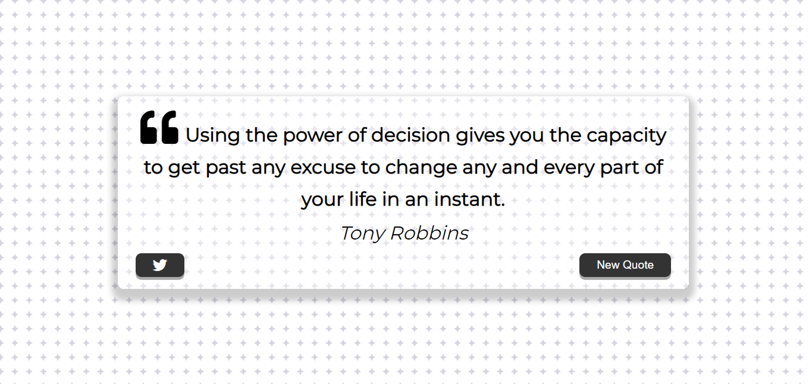

# ❝Inspiring-Quote
A responsive "quote generator" built with HTML, CSS and JS (ES6). It uses a third-party API to get the quotes through fetch requests.

Live Link: https://maksuda123.github.io/Inspiring-Quote/

This application display a random quote from API and it's allow user to share the quote through twitter.

 

## Planning
1. Fetching the data from API
2. Manipulating DOM
3. Create a loader
4. Share quote in social media

## Project Build Using
1. API : https://type.fit/api/quotes
2. JavaScript
3. HTML
4. CSS etc.

